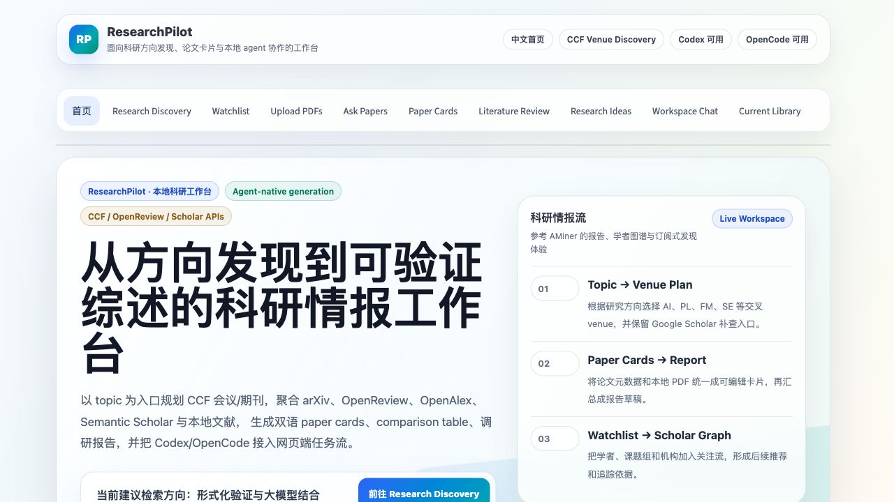
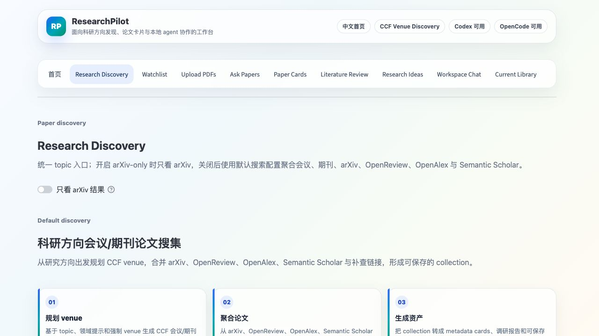
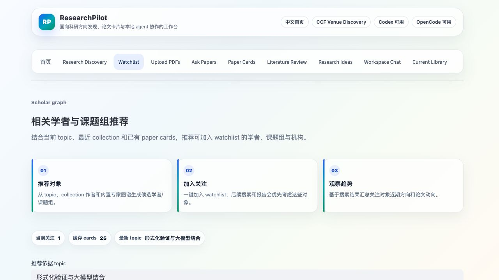
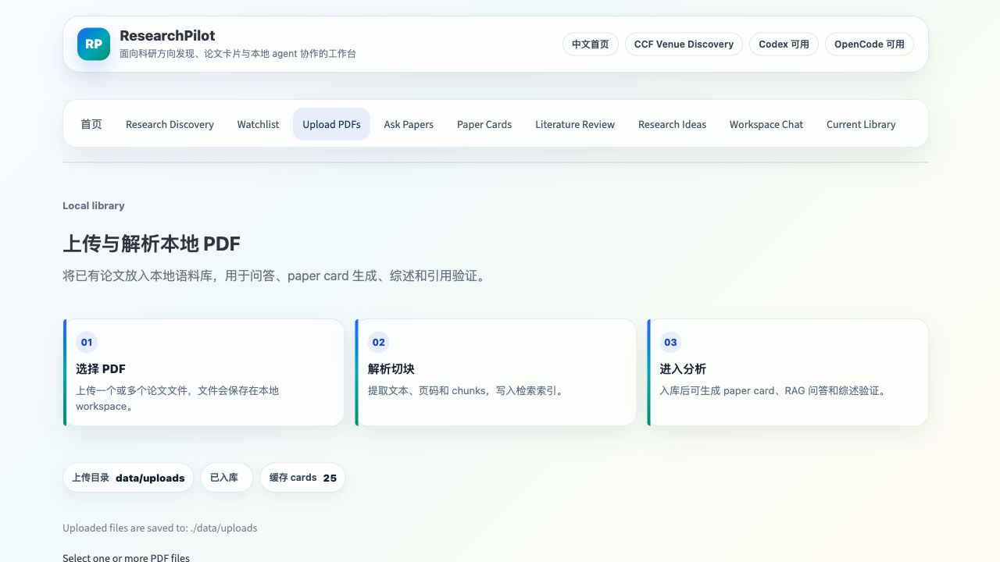
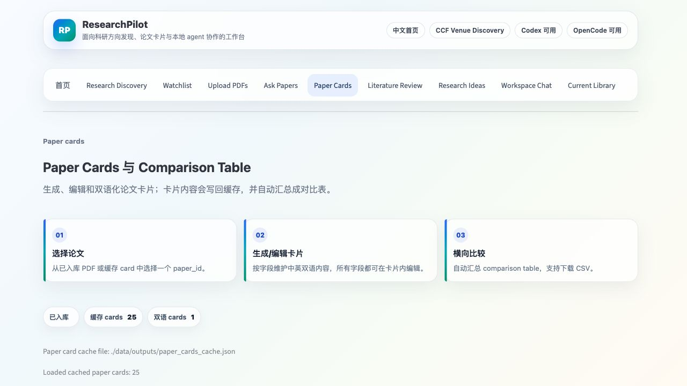
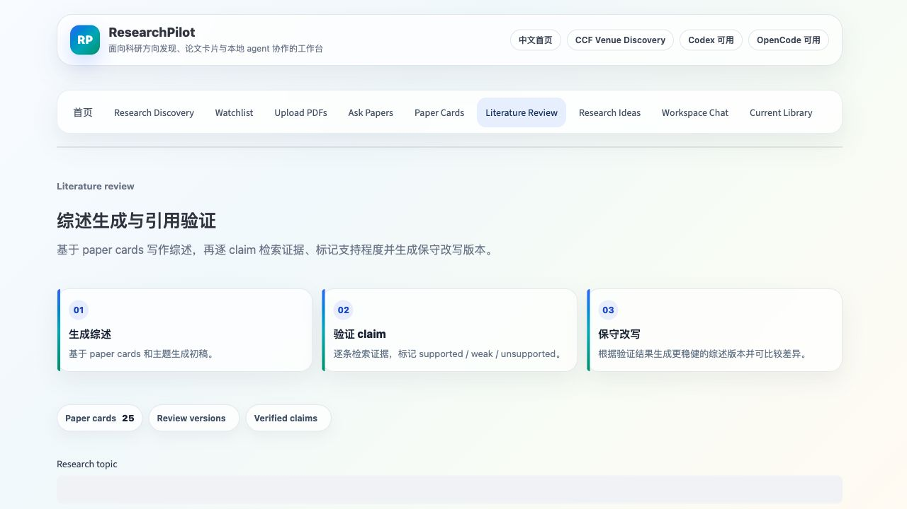
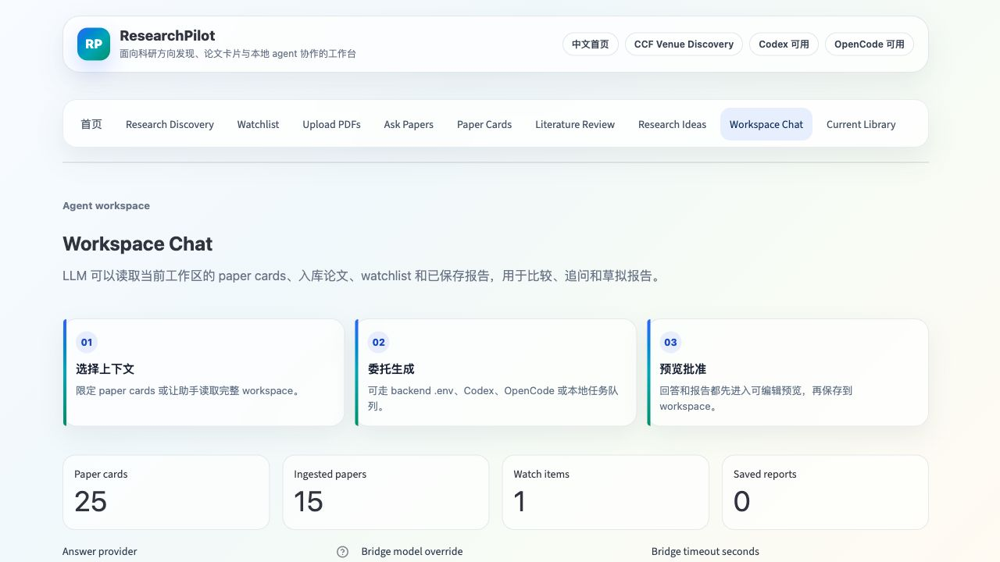
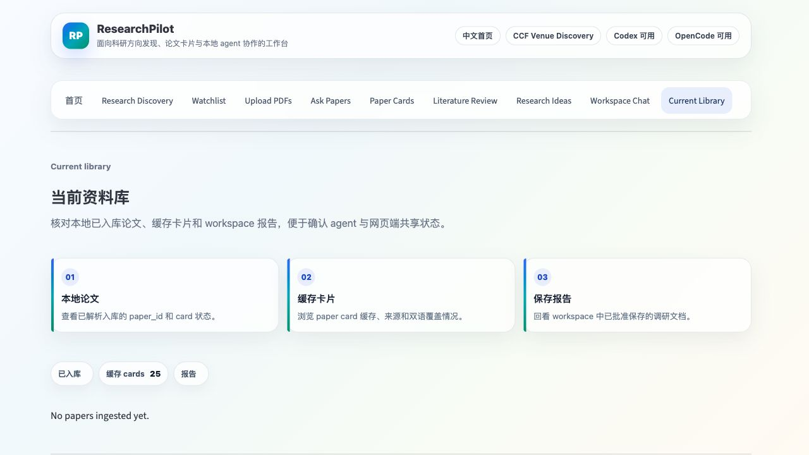

# ResearchPilot：带声明级引用验证和多轮修订闭环的 AI 科研助手

## 1. 项目简介
ResearchPilot 是一个面向科研调研场景的 AI research assistant。当前版本已经从早期的线性 demo 页面升级为一个中文科研工作台：顶部提供中文首页、统一 Research Discovery、Watchlist、PDF 入库、RAG QA、Paper Cards、Review、Workspace Chat 和 Current Library 等模块。

它支持从 topic 输入开始，完成 arXiv-only 快速搜索、CCF 会议/期刊方向搜集、OpenReview/OpenAlex/Semantic Scholar 元数据调研、PDF 下载与自动入库、PDF RAG 问答、论文卡片、论文比较、文献综述生成、声明级引用验证、保守改写、多轮修订、研究想法生成、个性化 watchlist、学者/课题组推荐、workspace chat 和本地 Codex/OpenCode agent 委托生成。

本项目是一个 **course-project prototype**。目标不是替代现有搜索引擎或专业文献管理工具，而是展示一个可落地的端到端科研调研 workflow，并将多个已有能力整合到同一条可追踪流程中。

完整流程如下：

topic -> Research Discovery（arXiv-only 或默认多源检索）-> venue / scholar source collection -> metadata paper cards -> PDF download/ingest -> hybrid retrieval -> RAG QA -> bilingual paper cards -> comparison table -> literature review -> claim verification -> conservative rewrite -> revised review -> research ideas -> workspace chat / report approval -> watchlist personalization

## 2. 核心功能概览
- 中文首页与统一前端工作台：首页展示当前能力、数据资产、agent bridge 状态和主要工作流入口
- Research Discovery 统一论文发现入口：开启 `只看 arXiv 结果` 时只做 arXiv 搜索、勾选下载和自动 ingest；关闭时使用默认多源配置，聚合会议/期刊、arXiv、OpenReview、OpenAlex、Semantic Scholar 等来源
- CCF 会议/期刊方向搜集：按领域推断 NeurIPS/ICML/ICLR、CAV/POPL/PLDI 等 venue，调用 arXiv/OpenReview/OpenAlex 和可选 Semantic Scholar 搜集近期论文，并生成 Google Scholar 补查链接
- 本地 PDF 上传与解析
- BM25 + vector search 的 hybrid retrieval
- 带 evidence citation 的 RAG QA
- Paper Card 结构化论文理解：支持缓存、双语字段、紧凑卡片渲染和逐字段编辑
- 网页端 Research Discovery：从 topic 规划 CCF venue，聚合会议/期刊、arXiv、OpenReview、OpenAlex、Semantic Scholar 等结果，生成调研报告，并可把候选论文转成 metadata paper cards
- 网页端 Workspace Chat：读取已缓存 paper cards、已入库论文、已有 topic/collection、watchlist 和已保存报告，支持预览、编辑并批准保存报告
- Local Agent Bridge：网页端生成报告、双语 paper card、workspace chat 时可委托本机 Codex/OpenCode CLI，或落盘为 agent task 队列，不再只能依赖 `.env` 后端
- Paper Card 本地缓存（`data/outputs/paper_cards_cache.json`，避免重复生成）
  - 缓存默认跨重启保留；仅当同一会话内对同一 `paper_id` 重新 ingest 时，才会失效该论文缓存。
- Comparison Table 多论文比较
- Literature Review 生成
- Claim-level Citation Verification
- Conservative Rewrite Suggestions
- 多版本 verify-then-rewrite 迭代
- Future Research Ideas 生成
- Personalized Watchlist 个性化关注、主页/学术索引、近 6 个月论文追踪、候选论文加入 Library/Card、忽略不感兴趣论文与趋势总结，并在页面顶部推荐相关学者、课题组和机构
- 子页面统一视觉设计：每个功能页都有 workflow cards、状态摘要、玻璃质感表单/表格/卡片和更清晰的数据模块分区

## 3. 创新点
### 3.1 端到端科研调研工作流
现有工具通常只覆盖单点功能，例如 PDF 问答、论文搜索或报告生成。用户在实际调研中往往需要在多个工具之间来回切换，导致上下文断裂、流程不可追踪、复现实验和演示成本较高。

ResearchPilot 将 topic-based paper discovery、arXiv 搜索、PDF 下载与入库、hybrid retrieval、RAG QA、paper cards、comparison table、literature review、claim verification、review rewriting、research ideas 与 watchlist personalization 组织为统一流程。

该设计的核心价值在于把科研调研过程从“零散工具调用”转变为“可追踪、可复用、可展示”的闭环流程，便于课程项目汇报、复盘和后续扩展。

对应模块或页面：首页、Research Discovery、Upload PDFs、Ask Papers、Paper Cards、Literature Review、Research Ideas、Watchlist、Workspace Chat、Current Library。
Workspace Chat 用于对齐本地 agent 端的 collection / report / paper-card 工作流；Local Agent Bridge 使网页端也能委托 Codex/OpenCode 生成内容。

### 3.2 声明级引用验证（Claim-level Citation Verification）
许多 RAG 系统能够生成带 citation 的回答或综述，但 citation 本身并不必然意味着该证据真实支持对应事实声明；在复杂场景下，仍可能出现证据不足、推断过强或语义错配。

ResearchPilot 在生成 literature review 之后，将综述拆解为 atomic factual claims，并针对每条 claim 使用 hybrid retriever 从论文 chunks 中重新检索 evidence。随后，系统通过 LLM judge 将 claim 标记为 supported、weakly_supported 或 unsupported，并给出 reason 与 evidence。

该机制将系统能力从 citation generation 推进到 citation verification，有助于识别 hallucinated、overstated 或 weakly grounded statements，提升综述的审查性与可信度。

对应模块或页面：`claim_verifier.py`，Literature Review tab 中的 Verify Claims。

补充说明（验证严格度与证据数量）：
- 系统支持 `strict / balanced / lenient` 三种 verification mode，默认使用 `balanced`。
- `strict` 更强调“直接且完整证据”，`lenient` 更倾向把边界情况标记为 `weakly_supported`，`balanced` 处于中间。
- 对背景性/动机性 claim，`balanced` 和 `lenient` 允许基于 evidence 的核心语义支持进行判断，不要求逐字匹配；但对数字、实验结果和比较性 claim 仍保持严格。
- `Evidence chunks per claim` 控制的是每条 claim 检索的证据数量，并不是严格度本身。
- `top_k` 越高通常能提供更多候选证据，但也可能引入噪声，需要结合具体任务权衡。
- claim extraction 会保留“来源：...”信息，并将来源提示写入 `source_hints`。
- 系统支持 source-aware evidence retrieval：当 claim 中包含“来源：论文标题”或“source: title”时，会优先基于 `paper card title / paper_id / chunk title` 等 metadata 做来源匹配。
- 系统采用 precision-first source matching；如果来源标题无法高置信匹配，不会强行匹配，而是回退到 diverse evidence retrieval。
- 例如会避免把 “Semantic Program Alignment for Equivalence Checking” 误匹配到 “Direct Construction of Program Alignment Automata for Equivalence Checking”。
- 默认启用 source-only 模式：当来源论文可匹配时，仅使用该来源论文证据进行验证；若来源证据不足，再从来源论文已入库 chunks 中补充。
- 当 claim 命中单一来源论文且 source-only 开启时，系统只从该来源论文取证据，并允许尽量取满 `Evidence chunks per claim (top_k)`。
- `Max evidence chunks per paper` 主要用于无来源 claim 的 diverse retrieval，或多来源 claim 的证据平衡。
- 当 claim 没有来源提示或匹配失败时，系统会启用 diverse evidence retrieval，避免单篇论文占满所有 evidence。
- 该机制使多论文综述中的 claim verification 更贴合生成综述时的来源标注。

### 3.3 验证—修订迭代闭环（Verify-then-rewrite Iterative Refinement）
传统综述生成通常是一次性产物，问题发现与修订高度依赖人工逐句修改，缺少系统化反馈回路。

ResearchPilot 将 verification results 反馈给写作模块：针对 weakly_supported / unsupported claims 生成 conservative rewrite suggestions，并进一步生成 revised literature review。换言之，**verification results are fed back into writing to produce more conservative revised reviews across multiple versions**。

系统维护 review version history，支持对 v0 Original、v1 Revised、v2 Revised 等版本进行比较，并可对任意版本再次 verify 与 rewrite，形成可持续迭代的闭环。

该设计的价值是让综述在多轮迭代中逐步趋于更保守、更可证据支撑，降低一次性生成带来的不稳定性。

对应模块或页面：`claim_rewriter.py`、`revised_review_generator.py`、`review_diff.py`，以及 Literature Review tab 的 version comparison 与 diff view。

### 3.4 结构化论文理解与多论文比较
直接让 LLM 基于长 PDF 生成综述，容易遗漏论文之间在问题设定、方法路径、结果证据与局限性的关键差异。

ResearchPilot 先将每篇论文抽取为 paper card，包括 problem、method、contribution、dataset、result、limitation、future_work 和 relevance；再将多个 paper cards 汇总为 comparison table，作为后续 literature review 与 research idea generation 的中间结构。

该设计将非结构化论文内容转化为可比较、可展示、可复用的科研知识单元，减少横向分析时的信息混乱和认知负担。

对应模块或页面：`paper_card_generator.py`、`comparison_table.py`，Paper Cards tab。

### 3.5 个性化科研关注与研究想法生成
传统论文搜索主要依赖 topic keywords，难以反映用户长期关注的 professor、research group、institution 或 keywords，也难把“关注偏好”直接转化为可执行的后续研究方向。

ResearchPilot 支持用户定义 watchlist，并在 arXiv 搜索结果中计算 `watchlist_score`、`matched_watch_items` 和 `match_reasons`，实现个性化排序与解释；同时基于 paper cards、original/revised review、claim verification signals 以及 weak/unsupported claims 生成候选 future research ideas。

该设计使系统从一次性检索工具扩展为个性化科研跟踪与选题辅助工具，增强持续调研场景下的实用性。

对应模块或页面：`watchlist_store.py`、`watchlist_ranker.py`、`watchlist_summary.py`、`research_idea_generator.py`，Watchlist 和 Research Ideas tabs。

## 4. 快速运行指南
### 4.1 运行环境建议
- Python 版本：建议 `Python 3.10+`（推荐 `3.11`）
- 硬件要求：不需要 GPU，CPU 可运行
- 依赖要求：需要可访问的 OpenAI-compatible API（用于聊天补全）
- 系统建议：推荐 macOS / Linux；Windows 也可运行，但命令可能略有差异

### 4.2 安装步骤
```bash
python3 -m venv .venv
source .venv/bin/activate
pip install -r requirements.txt
```

### 4.3 环境变量配置
从 `.env.example` 复制为 `.env`，并填写：

```env
OPENAI_API_KEY=
OPENAI_BASE_URL=
OPENAI_MODEL=
```

说明：
- 不要提交 `.env` 到仓库。

- 使用 OpenAI-compatible chat completions。

- 不要使用 `/v1/completions` + `messages` 组合。

  示例OPENAI_API_KEY=sk-xxxxx

  OPENAI_BASE_URL=https://llmapi.paratera.com/v1

  OPENAI_MODEL=DeepSeek-V3.2

### 4.4 启动应用
推荐使用脚本一键启动/停止 Streamlit 服务：

```bash
./scripts/start_research_pilot.sh
./scripts/stop_research_pilot.sh
```

启动脚本会在后台运行服务，默认地址是 `http://127.0.0.1:8501`，并写入：
- PID：`data/outputs/researchpilot_streamlit.pid`
- 日志：`data/outputs/researchpilot_streamlit.log`

如需换端口：

```bash
RESEARCHPILOT_PORT=8502 ./scripts/start_research_pilot.sh
RESEARCHPILOT_PORT=8502 ./scripts/stop_research_pilot.sh
```

也可以直接前台运行：

```bash
streamlit run app/streamlit_app.py --server.fileWatcherType none
```

补充说明：
- `--server.fileWatcherType none` 用于减少 Streamlit file watcher 扫描可选依赖时可能出现的 `torchvision` 警告。
- 停止脚本会优先使用 PID 文件；如果 PID 文件不存在，会只匹配本项目的 `streamlit app/streamlit_app.py` 进程，避免误停其它服务。

### 4.5 OpenCode Agent / Skills 测试
本项目已提供 OpenCode 可发现的本地 skill 和 tools：
- Skill：`.agents/skills/research-pilot/SKILL.md`
- Tools：`.opencode/tools/researchpilot.ts`
- Agent 配置：`opencode.json` 与 `.opencode/agents/research-pilot.md`
- Codex Skill：`.codex/skills/research-pilot/SKILL.md`

OpenCode agent 默认配置为 `opencode/minimax-m2.5-free`。首次使用时，在 OpenCode TUI 中执行 `/connect`，选择 `OpenCode Zen`，再用 `/models` 确认可用模型。

如果希望 ResearchPilot Python 后端也走同一个 Zen MiniMax M2.5 Free 通道，可在 `.env` 中配置：

```env
OPENAI_API_KEY=<your OpenCode Zen API key>
OPENAI_BASE_URL=https://opencode.ai/zen/v1
OPENAI_MODEL=minimax-m2.5-free
```

本地 adapter 可直接 smoke test：

```bash
python -m researchpilot.agent_cli status
python -m researchpilot.agent_cli ingest_text '{"paper_id":"demo","text":"Claim verification checks whether retrieved evidence supports a claim."}'
python -m researchpilot.agent_cli retrieve '{"query":"claim verification evidence","top_k":3}'
```

网页端 Local Agent Bridge 使用本机 CLI：
- Codex：`codex exec --cd <project> --sandbox read-only --ask-for-approval never -`
- OpenCode：`opencode run --dir <project> --agent research-pilot --file <prompt.md>`
- Queue：把任务写入 `data/outputs/agent_bridge/tasks/<task_id>/prompt.md`，之后可由 Codex/OpenCode 读取并完成。

如需接入其它本地 agent，可设置：

```env
RESEARCHPILOT_AGENT_COMMAND="your-agent-command-that-reads-prompt-from-stdin"
```

进入 OpenCode 后可切到 `research-pilot` agent，或让 agent 先调用 `researchpilot_status`，再按 `search_arxiv -> download_arxiv_result -> ingest_pdf -> build_paper_cards -> literature_review -> verify_review -> rewrite_review -> research_ideas` 跑完整闭环。

如果要让 Codex 全局发现该 skill，可将 `.codex/skills/research-pilot/` 同步到 `$CODEX_HOME/skills/research-pilot/`。

#### Agent-native 生成模式
如果不想在项目 `.env` 中配置 `OPENAI_API_KEY / OPENAI_BASE_URL / OPENAI_MODEL`，可以让 Codex 或 OpenCode 用自身订阅生成 LLM 内容，并让 ResearchPilot 只负责检索、校验和落盘。

原来的 API-key 模式仍然保留，作为 fallback 或自动批处理方案：只要 `.env` 配好 OpenAI-compatible API，就可以继续直接调用 `paper_card`、`build_paper_cards`、`literature_review`、`verify_review`、`rewrite_review`、`research_ideas` 等后端 LLM 命令。

典型 paper card 流程：

```bash
python -m researchpilot.agent_cli prepare_paper_card '{"paper_id":"2604.01851"}'
# 由当前 Codex/OpenCode agent 根据返回的 evidence 生成 paper card JSON
python -m researchpilot.agent_cli save_paper_card '{"card":{...}}'
python -m researchpilot.agent_cli comparison_table '{"paper_ids":["2604.01851"],"save_csv":true}'
```

对应 OpenCode tools 已暴露为 `researchpilot_plan_venue_collection`、`researchpilot_collect_venue_papers`、`researchpilot_prepare_venue_paper_summary`、`researchpilot_metadata_paper_cards`、`researchpilot_prepare_paper_card`、`researchpilot_save_paper_card`、`researchpilot_prepare_literature_review`、`researchpilot_prepare_review_verification`、`researchpilot_save_claim_verification`、`researchpilot_prepare_research_ideas` 和 `researchpilot_save_artifact`。

#### CCF 会议/期刊论文搜集
对于“不局限于 arXiv”的科研方向调研，可以先让 agent 规划 CCF 相关会议/期刊，再从 arXiv、OpenReview、OpenAlex、Semantic Scholar 等来源搜集论文：

```bash
python -m researchpilot.agent_cli plan_venue_collection '{"topic":"形式化验证与大模型结合","max_venues":12}'
python -m researchpilot.agent_cli collect_venue_papers '{"topic":"形式化验证与大模型结合","years":[2026,2025,2024],"max_results_per_venue":12,"max_total":60,"include_semantic_scholar":true}'
python -m researchpilot.agent_cli prepare_venue_paper_summary '{"max_papers":30}'
python -m researchpilot.agent_cli metadata_paper_cards '{"max_cards":10}'
```

`prepare_venue_paper_summary` 返回元数据、摘要、来源 URL 和写作指令，Codex/OpenCode 可以用自身订阅生成中文调研报告，再通过 `save_artifact` 落盘。若 `.env` 已配置，也可以直接调用 `venue_paper_summary` 走后端 API fallback。网页端的 Research Discovery 使用同一套采集逻辑：`.env` 配好时用后端 LLM 生成报告，否则会生成一个确定性的元数据报告预览。

注意：结果中的 `target_venue` 是系统按 CCF 规划去检索的 venue，`venue` 是 arXiv/OpenReview/OpenAlex/Semantic Scholar 报告的实际来源；`collection_scope: "arxiv"` 表示这是 arXiv 主题检索命中；`collection_scope: "broad_openalex"` 表示这是相关 OpenAlex 命中，不应表述为已发表在对应 CCF venue；`collection_scope: "broad_semantic_scholar"` 表示这是 Semantic Scholar 主题检索命中，需要人工确认 venue。

Codex skill 的渐进式说明在 `.codex/skills/research-pilot/references/agent-native-mode.md`；OpenCode skill 的对应说明在 `.agents/skills/research-pilot/references/agent-native-mode.md`。

## 5. 项目目录结构
```text
research-pilot/
  app/
    streamlit_app.py
  researchpilot/
    ingest/
    retrieval/
    qa/
    cards/
    review/
    verify/
    watchlist/
    llm/
    storage/
    schemas.py
    config.py
  scripts/
    smoke_*.py
  data/
    uploads/
    chunks/
    indices/
    outputs/
  third_party/
  requirements.txt
  .env.example
  README.md
```

目录说明：
- `app/`：Streamlit 前端入口。
- `researchpilot/`：核心业务模块。
- `scripts/`：各阶段 smoke test 脚本。
- `data/`：上传文件、索引与输出数据目录。
- `third_party/`：外部参考仓库（只读参考，不在本项目中修改）。

## 6. Streamlit 页面与功能映射
当前主要页面（tabs）：
1. `首页`：中文能力介绍、功能导航、共享数据模块概览和 Local Agent Bridge 状态。
2. `Research Discovery`：统一 topic 入口；开启 `只看 arXiv 结果` 时只返回 arXiv，关闭时默认聚合会议、期刊、arXiv、OpenReview、OpenAlex、Semantic Scholar 等来源。
3. `Watchlist`：展示相关学者/课题组/机构推荐，管理关注对象（professor / group / institution / keywords）；对学者/机构/课题组提供主页索引、近 6 个月论文追踪、候选论文加入 Library/Card、忽略不感兴趣论文和趋势总结。
4. `Upload PDFs`：本地 PDF 上传、解析、切块并入库。
5. `Ask Papers`：基于混合检索的 citation-grounded RAG QA。
6. `Paper Cards`：生成结构化论文卡片、双语化、逐字段编辑和 comparison table。
7. `Literature Review`：综述生成、claim verification、多版本修订与 diff。
8. `Research Ideas`：基于 cards/review/verification 生成候选研究方向。
9. `Workspace Chat`：读取工作区上下文进行对话、报告预览和批准保存；可走 backend `.env`、Codex/OpenCode 或 task queue。
10. `Current Library`：查看当前已入库论文、缓存 paper cards 和 workspace reports。

所有子页面都采用统一的三步 workflow cards、状态摘要 chips 和玻璃质感面板，便于演示时说明每个模块在完整科研流程中的位置。

## 7. Demo 演示流程
以下截图对应 2026-05-17 版本的新版前端。

1. 进入首页，先说明 ResearchPilot 的整体定位、数据模块和 agent bridge 能力。

   

2. 在 `Research Discovery` 中输入 topic。默认模式会规划 CCF venue 并聚合会议/期刊、arXiv、OpenReview、OpenAlex、Semantic Scholar；如只想复现旧版 arXiv demo，可打开 `只看 arXiv 结果`。

   

3. 在 `Watchlist` 中查看系统推荐的相关学者、课题组和机构，并可一键加入关注列表。新加入的学者/机构/课题组会默认触发一次主页索引与近 6 个月论文追踪；已有关注对象可点击追踪按钮刷新推荐论文，用户可以将论文加入 Library/Card 或移出该关注对象的推荐页。

   

4. 在 `Upload PDFs` 上传本地论文，完成解析、切块和本地入库。

   

5. 在 `Paper Cards` 中选择论文或缓存 card，生成/编辑双语 paper card，并自动汇总 comparison table。

   

6. 在 `Literature Review` 中生成综述，再执行 claim-level citation verification、保守改写和版本 diff。Verify Claims 可能耗时较久，取决于论文数量和 evidence chunks 设置。

   

7. 在 `Workspace Chat` 中让 LLM 读取当前工作区的 cards、ingested papers、watchlist、collection 和已保存 reports，生成回答或报告草稿。生成方式可以选择 backend `.env`、Codex、OpenCode、queue 或 deterministic fallback。

   

8. 在 `Current Library` 核对当前已入库论文、缓存 paper cards 和 workspace reports，确认网页端与本地 agent 端共享的状态。

   

## 8. Smoke Tests（命令速查）
- PDF parsing
```bash
python scripts/smoke_parse_pdf.py data/uploads/example.pdf
```

- BM25 retrieval
```bash
python scripts/smoke_bm25.py data/uploads/example.pdf "program alignment"
```

- Vector retrieval
```bash
python scripts/smoke_vector.py data/uploads/example.pdf "program alignment"
```

- Hybrid retrieval
```bash
python scripts/smoke_hybrid.py data/uploads/example.pdf "program alignment"
```

- LLM client
```bash
python scripts/smoke_llm.py "hello"
```

- RAG QA
```bash
python scripts/smoke_rag_qa.py data/uploads/example.pdf "这篇论文主要解决什么问题？"
```

- Paper card generation
```bash
python scripts/smoke_paper_card.py data/uploads/example.pdf
```

- arXiv search
```bash
python scripts/smoke_arxiv_search.py "program equivalence checking semantic alignment" --max-results 5
```

- arXiv search + 下载第一篇 PDF
```bash
python scripts/smoke_arxiv_search.py "program equivalence checking semantic alignment" --max-results 5 --download-first
```

## 9. Third-party 参考说明
`third_party/` 目录仅用于阅读和参考，不作为本项目直接依赖代码进行修改。

参考仓库包括：
- `paper-qa`
- `gpt-researcher`
- `storm`
- `litllm`
- `ScholarLens`

## 10. 已知局限与后续工作
- 当前 watchlist 推荐主要来自内置 seed graph、collection 作者频次和字符串匹配；后续可接 Semantic Scholar / OpenAlex / AMiner author-institution graph。
- claim-level citation verification 结果依赖检索质量与 LLM judgment，存在不确定性。
- PDF parsing 对复杂公式、图表和表格结构仍有限。
- research ideas 为候选研究假设，不应直接视作可验证结论。
- Paper cards、workspace reports、agent bridge tasks 等已经落盘；但部分前端选择、临时 collection 和正在编辑的 draft 仍依赖 `session_state`（内存态），应用重启后可能需要重新加载或重新生成。
- Local Agent Bridge 调用 Codex/OpenCode CLI 时依赖本机 CLI 是否已安装、登录和可访问；`.env` 后端逻辑仍保留作为 fallback。

## 11. 课程提交说明（建议）
- 建议在报告中明确：ResearchPilot 的贡献是工程集成与流程设计，而非宣称提出全新底层算法。
- 建议附上一次完整 demo 路径（从 search 到 verify-rewrite 再到 ideas）。
- 建议结合 Smoke Tests 截图或日志，说明各模块已可独立运行。
