# ResearchPilot：带声明级引用验证和多轮修订闭环的 AI 科研助手

## 1. 项目简介
ResearchPilot 是一个面向科研调研场景的 AI research assistant。

它支持从 topic 输入开始，完成 arXiv 论文搜索、PDF 下载与自动入库、PDF RAG 问答、论文卡片、论文比较、文献综述生成、声明级引用验证、保守改写、多轮修订、研究想法生成和个性化 watchlist。

本项目是一个 **course-project prototype**。目标不是替代现有搜索引擎或专业文献管理工具，而是展示一个可落地的端到端科研调研 workflow，并将多个已有能力整合到同一条可追踪流程中。

完整流程如下：

topic -> arXiv search -> PDF download/ingest -> hybrid retrieval -> RAG QA -> paper cards -> comparison table -> literature review -> claim verification -> conservative rewrite -> revised review -> research ideas -> watchlist personalization

## 2. 核心功能概览
- arXiv 论文搜索、勾选下载、自动 ingest
- 本地 PDF 上传与解析
- BM25 + vector search 的 hybrid retrieval
- 带 evidence citation 的 RAG QA
- Paper Card 结构化论文理解
- Paper Card 本地缓存（`data/outputs/paper_cards_cache.json`，避免重复生成）
  - 缓存默认跨重启保留；仅当同一会话内对同一 `paper_id` 重新 ingest 时，才会失效该论文缓存。
- Comparison Table 多论文比较
- Literature Review 生成
- Claim-level Citation Verification
- Conservative Rewrite Suggestions
- 多版本 verify-then-rewrite 迭代
- Future Research Ideas 生成
- Personalized Watchlist 个性化关注与趋势总结

## 3. 创新点
### 3.1 端到端科研调研工作流
现有工具通常只覆盖单点功能，例如 PDF 问答、论文搜索或报告生成。用户在实际调研中往往需要在多个工具之间来回切换，导致上下文断裂、流程不可追踪、复现实验和演示成本较高。

ResearchPilot 将 topic-based paper discovery、arXiv 搜索、PDF 下载与入库、hybrid retrieval、RAG QA、paper cards、comparison table、literature review、claim verification、review rewriting、research ideas 与 watchlist personalization 组织为统一流程。

该设计的核心价值在于把科研调研过程从“零散工具调用”转变为“可追踪、可复用、可展示”的闭环流程，便于课程项目汇报、复盘和后续扩展。

对应模块或页面：Search Papers、Upload PDFs、Ask Papers、Paper Cards、Literature Review、Research Ideas、Watchlist。

### 3.2 声明级引用验证（Claim-level Citation Verification）
许多 RAG 系统能够生成带 citation 的回答或综述，但 citation 本身并不必然意味着该证据真实支持对应事实声明；在复杂场景下，仍可能出现证据不足、推断过强或语义错配。

ResearchPilot 在生成 literature review 之后，将综述拆解为 atomic factual claims，并针对每条 claim 使用 hybrid retriever 从论文 chunks 中重新检索 evidence。随后，系统通过 LLM judge 将 claim 标记为 supported、weakly_supported 或 unsupported，并给出 reason 与 evidence。

该机制将系统能力从 citation generation 推进到 citation verification，有助于识别 hallucinated、overstated 或 weakly grounded statements，提升综述的审查性与可信度。

对应模块或页面：`claim_verifier.py`，Literature Review tab 中的 Verify Claims。

补充说明（验证严格度与证据数量）：
- 系统支持 `strict / balanced / lenient` 三种 verification mode，默认使用 `balanced`。
- `strict` 更强调“直接且完整证据”，`lenient` 更倾向把边界情况标记为 `weakly_supported`，`balanced` 处于中间。
- 对背景性/动机性 claim，`balanced` 和 `lenient` 允许基于 evidence 的核心语义支持进行判断，不要求逐字匹配；但对数字、实验结果和比较性 claim 仍保持严格。
- `Evidence chunks per claim` 控制的是每条 claim 检索的证据数量，并不是严格度本身。
- `top_k` 越高通常能提供更多候选证据，但也可能引入噪声，需要结合具体任务权衡。
- claim extraction 会保留“来源：...”信息，并将来源提示写入 `source_hints`。
- 系统支持 source-aware evidence retrieval：当 claim 中包含“来源：论文标题”或“source: title”时，会优先基于 `paper card title / paper_id / chunk title` 等 metadata 做来源匹配。
- 系统采用 precision-first source matching；如果来源标题无法高置信匹配，不会强行匹配，而是回退到 diverse evidence retrieval。
- 例如会避免把 “Semantic Program Alignment for Equivalence Checking” 误匹配到 “Direct Construction of Program Alignment Automata for Equivalence Checking”。
- 默认启用 source-only 模式：当来源论文可匹配时，仅使用该来源论文证据进行验证；若来源证据不足，再从来源论文已入库 chunks 中补充。
- 当 claim 命中单一来源论文且 source-only 开启时，系统只从该来源论文取证据，并允许尽量取满 `Evidence chunks per claim (top_k)`。
- `Max evidence chunks per paper` 主要用于无来源 claim 的 diverse retrieval，或多来源 claim 的证据平衡。
- 当 claim 没有来源提示或匹配失败时，系统会启用 diverse evidence retrieval，避免单篇论文占满所有 evidence。
- 该机制使多论文综述中的 claim verification 更贴合生成综述时的来源标注。

### 3.3 验证—修订迭代闭环（Verify-then-rewrite Iterative Refinement）
传统综述生成通常是一次性产物，问题发现与修订高度依赖人工逐句修改，缺少系统化反馈回路。

ResearchPilot 将 verification results 反馈给写作模块：针对 weakly_supported / unsupported claims 生成 conservative rewrite suggestions，并进一步生成 revised literature review。换言之，**verification results are fed back into writing to produce more conservative revised reviews across multiple versions**。

系统维护 review version history，支持对 v0 Original、v1 Revised、v2 Revised 等版本进行比较，并可对任意版本再次 verify 与 rewrite，形成可持续迭代的闭环。

该设计的价值是让综述在多轮迭代中逐步趋于更保守、更可证据支撑，降低一次性生成带来的不稳定性。

对应模块或页面：`claim_rewriter.py`、`revised_review_generator.py`、`review_diff.py`，以及 Literature Review tab 的 version comparison 与 diff view。

### 3.4 结构化论文理解与多论文比较
直接让 LLM 基于长 PDF 生成综述，容易遗漏论文之间在问题设定、方法路径、结果证据与局限性的关键差异。

ResearchPilot 先将每篇论文抽取为 paper card，包括 problem、method、contribution、dataset、result、limitation、future_work 和 relevance；再将多个 paper cards 汇总为 comparison table，作为后续 literature review 与 research idea generation 的中间结构。

该设计将非结构化论文内容转化为可比较、可展示、可复用的科研知识单元，减少横向分析时的信息混乱和认知负担。

对应模块或页面：`paper_card_generator.py`、`comparison_table.py`，Paper Cards tab。

### 3.5 个性化科研关注与研究想法生成
传统论文搜索主要依赖 topic keywords，难以反映用户长期关注的 professor、research group、institution 或 keywords，也难把“关注偏好”直接转化为可执行的后续研究方向。

ResearchPilot 支持用户定义 watchlist，并在 arXiv 搜索结果中计算 `watchlist_score`、`matched_watch_items` 和 `match_reasons`，实现个性化排序与解释；同时基于 paper cards、original/revised review、claim verification signals 以及 weak/unsupported claims 生成候选 future research ideas。

该设计使系统从一次性检索工具扩展为个性化科研跟踪与选题辅助工具，增强持续调研场景下的实用性。

对应模块或页面：`watchlist_store.py`、`watchlist_ranker.py`、`watchlist_summary.py`、`research_idea_generator.py`，Watchlist 和 Research Ideas tabs。

## 4. 快速运行指南
### 4.1 运行环境建议
- Python 版本：建议 `Python 3.10+`（推荐 `3.11`）
- 硬件要求：不需要 GPU，CPU 可运行
- 依赖要求：需要可访问的 OpenAI-compatible API（用于聊天补全）
- 系统建议：推荐 macOS / Linux；Windows 也可运行，但命令可能略有差异

### 4.2 安装步骤
```bash
python3 -m venv .venv
source .venv/bin/activate
pip install -r requirements.txt
```

### 4.3 环境变量配置
从 `.env.example` 复制为 `.env`，并填写：

```env
OPENAI_API_KEY=
OPENAI_BASE_URL=
OPENAI_MODEL=
```

说明：
- 不要提交 `.env` 到仓库。
- 使用 OpenAI-compatible chat completions。
- 不要使用 `/v1/completions` + `messages` 组合。

### 4.4 启动应用
推荐命令：

```bash
streamlit run app/streamlit_app.py --server.fileWatcherType none
```

补充说明：
- `--server.fileWatcherType none` 用于减少 Streamlit file watcher 扫描可选依赖时可能出现的 `torchvision` 警告。

## 5. 项目目录结构
```text
research-pilot/
  app/
    streamlit_app.py
  researchpilot/
    ingest/
    retrieval/
    qa/
    cards/
    review/
    verify/
    watchlist/
    llm/
    storage/
    schemas.py
    config.py
  scripts/
    smoke_*.py
  data/
    uploads/
    chunks/
    indices/
    outputs/
  third_party/
  requirements.txt
  .env.example
  README.md
```

目录说明：
- `app/`：Streamlit 前端入口。
- `researchpilot/`：核心业务模块。
- `scripts/`：各阶段 smoke test 脚本。
- `data/`：上传文件、索引与输出数据目录。
- `third_party/`：外部参考仓库（只读参考，不在本项目中修改）。

## 6. Streamlit 页面与功能映射
当前主要页面（tabs）：
1. `Search Papers`：arXiv 搜索、watchlist 排序、论文下载与可选自动 ingest。
2. `Watchlist`：管理关注对象（professor / group / institution / keywords）与趋势总结。
3. `Upload PDFs`：本地 PDF 上传并入库。
4. `Ask Papers`：基于混合检索的 citation-grounded RAG QA。
5. `Paper Cards`：生成结构化论文卡片和 comparison table。
6. `Literature Review`：综述生成、claim verification、多版本修订与 diff。
7. `Research Ideas`：基于 cards/review/verification 生成候选研究方向。
8. `Current Library`：查看当前已入库论文状态。

## 7. Demo 演示流程
1. 在 Watchlist tab 新增一个关注项（如 Stanford OVAL / Monica Lam / RAG）。

   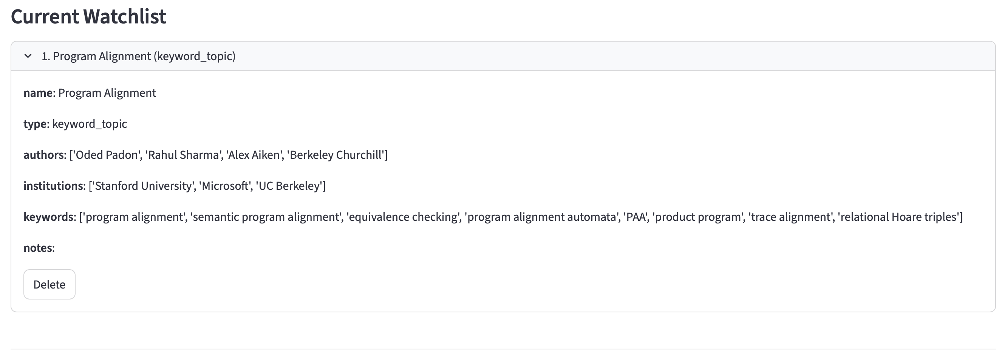

2. 在 Search Papers tab 输入 topic 并搜索 arXiv。

   其中搜索到了带🌟的论文包含在watchlist中标明的关键信息

   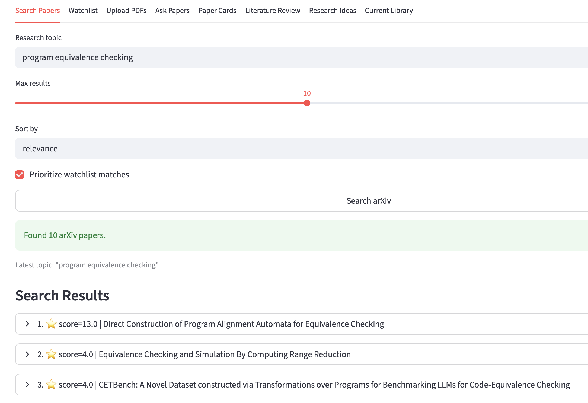

3. 观察 watchlist_score 与匹配原因，勾选论文下载。

4. 开启 auto ingest，将 PDF 自动入库。

   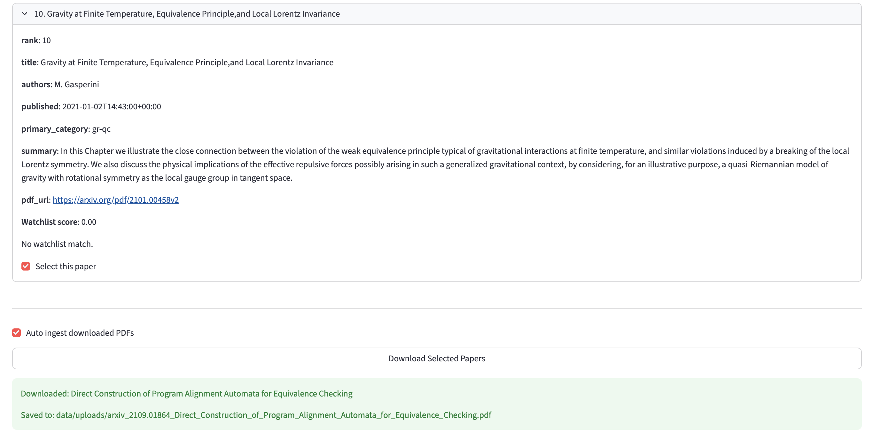

5. 可以上传入库更多你觉得需要的文章

   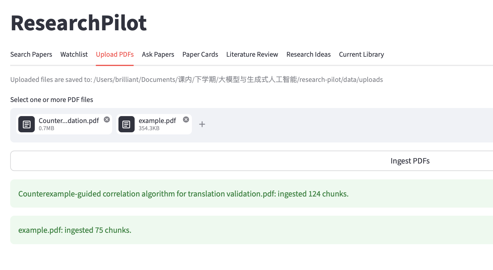

6. 在 Ask Papers tab 提问并展示带 evidence citation 的回答。

   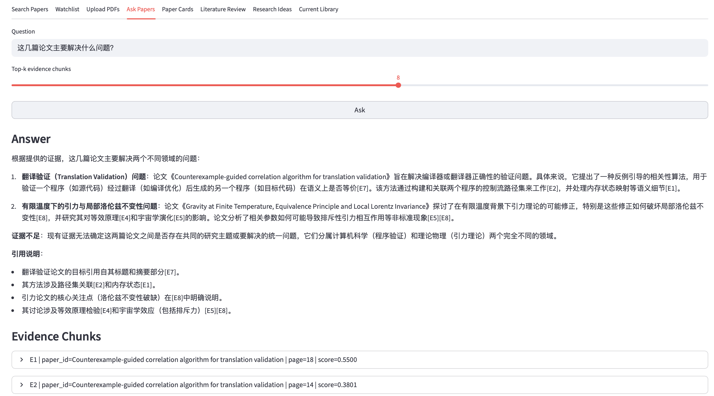

7. 在 Paper Cards tab 生成 paper card，并展示 comparison table。

   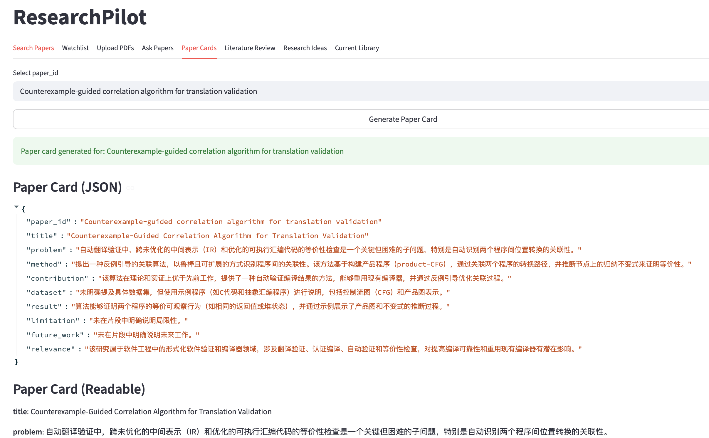

8. 在 Literature Review tab 生成 v0 原始综述，如尝试生成program equivalence checking and semantic alignment的综述：

   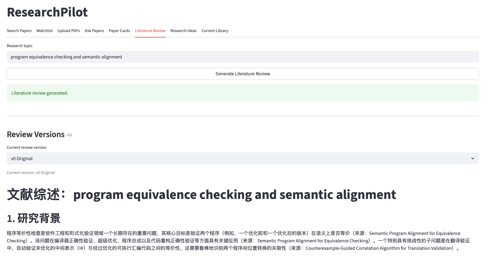

9. 执行 Verify Claims，查看 supported / weakly_supported / unsupported。这一步执行的时间会比较久

   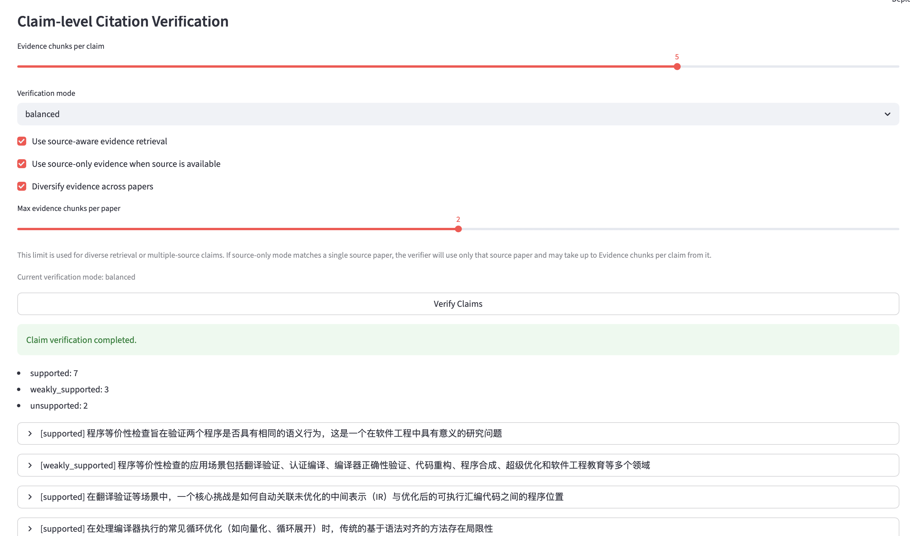

10. 生成 conservative rewrite 与 revised review（v1）。

11. 对比 v0 与 v1，展示 side-by-side 和 diff。

    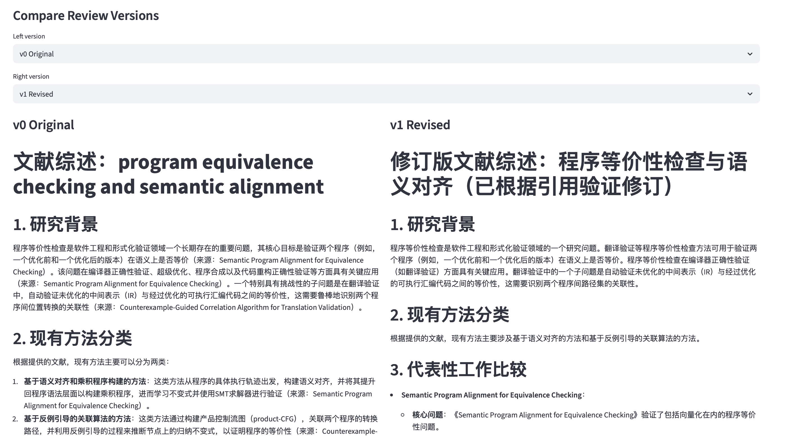

    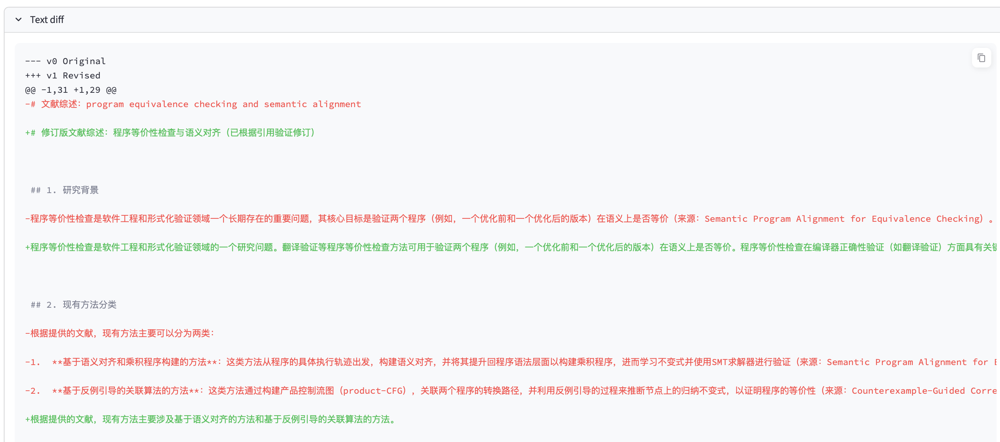

12. 可继续 verify v1 并生成 v2，迭代闭环。

13. 在 Research Ideas tab 生成候选 future research ideas。

    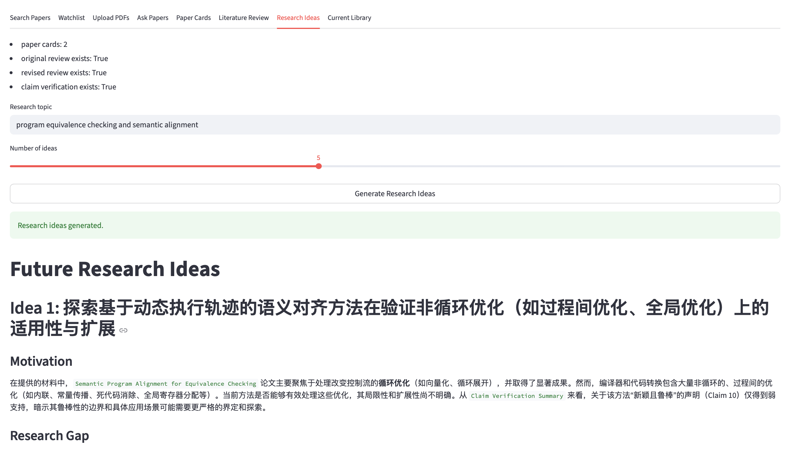

## 8. Smoke Tests（命令速查）
- PDF parsing
```bash
python scripts/smoke_parse_pdf.py data/uploads/example.pdf
```

- BM25 retrieval
```bash
python scripts/smoke_bm25.py data/uploads/example.pdf "program alignment"
```

- Vector retrieval
```bash
python scripts/smoke_vector.py data/uploads/example.pdf "program alignment"
```

- Hybrid retrieval
```bash
python scripts/smoke_hybrid.py data/uploads/example.pdf "program alignment"
```

- LLM client
```bash
python scripts/smoke_llm.py "hello"
```

- RAG QA
```bash
python scripts/smoke_rag_qa.py data/uploads/example.pdf "这篇论文主要解决什么问题？"
```

- Paper card generation
```bash
python scripts/smoke_paper_card.py data/uploads/example.pdf
```

- arXiv search
```bash
python scripts/smoke_arxiv_search.py "program equivalence checking semantic alignment" --max-results 5
```

- arXiv search + 下载第一篇 PDF
```bash
python scripts/smoke_arxiv_search.py "program equivalence checking semantic alignment" --max-results 5 --download-first
```

## 9. Third-party 参考说明
`third_party/` 目录仅用于阅读和参考，不作为本项目直接依赖代码进行修改。

参考仓库包括：
- `paper-qa`
- `gpt-researcher`
- `storm`
- `litllm`
- `ScholarLens`

## 10. 已知局限与后续工作
- 当前 watchlist 主要基于 arXiv metadata 与字符串匹配；后续可接 Semantic Scholar / OpenAlex author/institution graph。
- claim-level citation verification 结果依赖检索质量与 LLM judgment，存在不确定性。
- PDF parsing 对复杂公式、图表和表格结构仍有限。
- research ideas 为候选研究假设，不应直接视作可验证结论。
- 当前状态主要依赖 `session_state`（内存态），应用重启后需重新 ingest / regenerate。

## 11. 课程提交说明（建议）
- 建议在报告中明确：ResearchPilot 的贡献是工程集成与流程设计，而非宣称提出全新底层算法。
- 建议附上一次完整 demo 路径（从 search 到 verify-rewrite 再到 ideas）。
- 建议结合 Smoke Tests 截图或日志，说明各模块已可独立运行。
